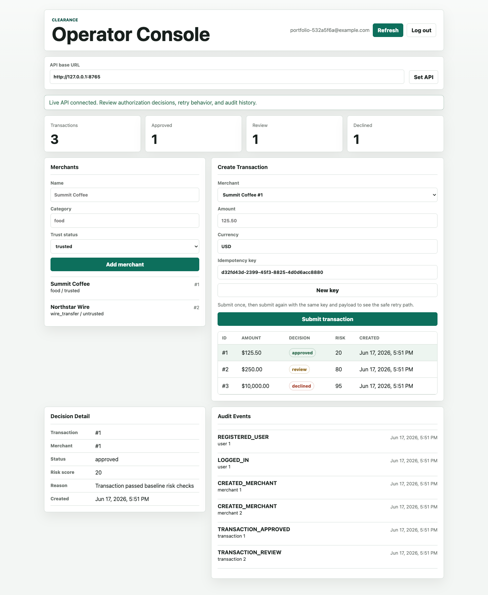

# Clearance

[](https://github.com/CTran10/clearance/actions/workflows/ci.yml)

Clearance is a backend-focused portfolio project for a transaction authorization
platform. It models the kind of system a payments, risk, fintech, or internal
platform team might build: authenticated clients submit transactions, the API
evaluates risk rules, stores an authorization decision, enforces idempotent
retries, and records audit history.

The project is intentionally more than CRUD. It is built to demonstrate backend
engineering fundamentals that matter in production-style systems: durable
storage, API contracts, authentication, authorization boundaries, database
constraints, idempotency, migrations, observability, verification, and explicit
tradeoffs.



## What This Demonstrates

- FastAPI service design with thin routes and service-layer domain logic.
- JWT authentication with issuer, audience, expiration, and deleted-user checks.
- User-owned resource scoping for merchants, transactions, and audit events.
- Idempotent transaction creation with `Idempotency-Key` and canonical request hashes.
- Risk decisions for amount thresholds, merchant trust, category, currency, and velocity.
- Audit logs for registration, login, merchant creation, and authorization decisions.
- Alembic migrations as the production-style schema authority.
- SQLite-backed fast tests plus optional Postgres integration tests for database-specific behavior.
- CI coverage, Ruff linting/format checks, frontend tests, and a live API smoke test.
- A small dependency-free operator console that makes the backend behavior visible.

## Product Slice

The current slice supports:

- `POST /auth/register`
- `POST /auth/login`
- `GET /users/me`
- `POST /merchants`
- `GET /merchants`
- `POST /transactions`
- `GET /transactions`
- `GET /transactions/{id}`
- `GET /audit-events`
- `GET /health`
- `GET /health/db`

Transaction submission requires an `Idempotency-Key`. A retry with the same key
and same payload returns the original transaction. Reusing the same key with a
different payload returns `409 Conflict`.

## Architecture

Clearance is a modular monolith: one deployable FastAPI service organized by
domain boundary.

```txt
Client / Console
  -> FastAPI middleware
     -> auth routes
     -> merchant routes
     -> transaction routes
        -> risk rules
        -> idempotency checks
        -> audit writes
     -> audit routes
  -> SQLAlchemy
  -> Postgres in production-like environments
```

The detailed diagrams and request flows live in
[docs/architecture.md](docs/architecture.md).

## Stack

- FastAPI for HTTP routing and request handling
- Pydantic for request and response contracts
- SQLAlchemy for ORM models and database sessions
- Alembic for migrations
- Postgres for durable storage
- Docker Compose for local Postgres
- passlib with `bcrypt_sha256` for password hashing
- python-jose for JWT signing and verification
- pytest, coverage, httpx, and Ruff for verification
- Dependency-free HTML/CSS/JavaScript frontend console

## Quick Start

Install dependencies:

```bash
.venv/bin/python -m pip install -r requirements-dev.txt
```

Create a local `.env` from `.env.example`, then replace the placeholder
`SECRET_KEY` and local database password values.

Generate a development secret:

```bash
python -c "import secrets; print(secrets.token_urlsafe(32))"
```

Start Postgres:

```bash
make db-up
```

Apply migrations:

```bash
.venv/bin/alembic upgrade head
```

Run the API:

```bash
make run
```

Open API health:

```bash
curl -i http://127.0.0.1:8000/health
curl -i http://127.0.0.1:8000/health/db
```

## Operator Console

The frontend is a thin local console for portfolio review and manual testing. It
is not trying to be a second full application.

Start the API, then serve the console:

```bash
cd frontend
python3 -m http.server 5173
```

Open:

```txt
http://127.0.0.1:5173
```

If browser requests are blocked by CORS, include the console origin in `.env`:

```env
CORS_ORIGINS=http://127.0.0.1:5173,http://localhost:5173
```

The console can register/login, create merchants, submit transactions, retry an
idempotency key, and inspect decisions and audit events.

## Verification

Run the same checks locally that CI is expected to enforce:

```bash
make lint
make coverage
make frontend-test
```

Run the live API smoke test after the API is running:

```bash
make smoke
```

The smoke test exercises the system through HTTP:

1. Health and database readiness.
2. Register and login.
3. Create trusted and untrusted merchants.
4. Create an approved transaction.
5. Retry the same idempotency key and confirm the original transaction returns.
6. Reuse the key with a different payload and confirm `409 Conflict`.
7. Create review and declined decisions.
8. Confirm audit events were recorded.

Current local verification from this repo state:

- Backend tests: `48 passed, 5 skipped`
- Coverage: `92%`
- Frontend tests: `7 passed`
- Live API smoke test: passing

The skipped tests are Postgres integration tests when
`POSTGRES_INTEGRATION_DATABASE_URL` is not set locally. CI provides Postgres and
runs those integration tests.

## CI

GitHub Actions runs:

```bash
python -m ruff check .
python -m ruff format --check .
python -m alembic upgrade head
python -m coverage run -m pytest
python -m coverage report
python scripts/smoke_api.py
npm test
```

The CI job starts a Postgres service, applies migrations, runs database-aware
tests, starts the API locally, then runs the smoke workflow against the live
server.

## API Walkthrough

Register:

```bash
curl -i -X POST http://127.0.0.1:8000/auth/register \
  -H "Content-Type: application/json" \
  -d '{"email":"calvin@example.com","password":"Password1!"}'
```

Login:

```bash
curl -i -X POST http://127.0.0.1:8000/auth/login \
  -H "Content-Type: application/json" \
  -d '{"email":"calvin@example.com","password":"Password1!"}'
```

Create a merchant:

```bash
curl -i -X POST http://127.0.0.1:8000/merchants \
  -H "Content-Type: application/json" \
  -H "Authorization: Bearer PASTE_TOKEN_HERE" \
  -d '{"name":"Summit Coffee","category":"food","trust_status":"trusted"}'
```

Create a transaction:

```bash
curl -i -X POST http://127.0.0.1:8000/transactions \
  -H "Content-Type: application/json" \
  -H "Authorization: Bearer PASTE_TOKEN_HERE" \
  -H "Idempotency-Key: demo-key-001" \
  -d '{"merchant_id":1,"amount":"125.50","currency":"USD"}'
```

Retry the same transaction request with the same `Idempotency-Key` to see the
safe retry path. Reuse the same key with a different payload to see the conflict
path.

List audit events:

```bash
curl -i http://127.0.0.1:8000/audit-events \
  -H "Authorization: Bearer PASTE_TOKEN_HERE"
```

## Security And Reliability Notes

- Passwords are stored as hashes, not raw passwords.
- New password hashes use `bcrypt_sha256` to avoid raw bcrypt's 72-byte password limit.
- JWTs include issuer, audience, issued-at, and expiration claims.
- `SECRET_KEY` is required at startup and cannot use the placeholder value.
- Protected routes resolve the current user server-side.
- User-owned resources are filtered by `current_user.id`.
- Unknown request fields are rejected.
- Request bodies over `MAX_REQUEST_BODY_BYTES` are rejected while streaming.
- CORS origins are configured by environment.
- Request IDs are validated before being logged or echoed.
- Basic security headers and `Cache-Control: no-store` are added by middleware.
- Rate limiting is in-memory by design for the current single-process scope.
- Proxy headers are ignored unless explicitly trusted through CIDR configuration.

## Migrations

Run migrations:

```bash
.venv/bin/alembic upgrade head
```

Generate a new migration after changing models:

```bash
.venv/bin/alembic revision --autogenerate -m "describe schema change"
```

For production-like environments, keep `AUTO_CREATE_TABLES=false` and use
Alembic as the schema authority. See [docs/deployment.md](docs/deployment.md)
for rollout and rollback notes.

## Project Structure

```txt
app/
  auth/
  audit/
  core/
  db/
  merchants/
  middleware/
  transactions/
  users/
docs/
frontend/
migrations/
scripts/
tests/
```

Key files:

- `app/main.py` wires the application.
- `app/core/config.py` owns environment-backed settings.
- `app/core/security.py` owns password hashing and JWT helpers.
- `app/transactions/service.py` owns transaction creation and idempotency behavior.
- `app/transactions/risk.py` owns authorization decision rules.
- `scripts/smoke_api.py` verifies the live HTTP workflow.
- `frontend/` contains the local operator console.

## Tradeoffs

This project is intentionally production-style, not production-complete.

- It starts as a modular monolith instead of premature microservices.
- Risk rules are environment-backed until the domain needs live rule management.
- Rate limiting is in-memory until there is multi-instance pressure.
- Fast tests use SQLite, while Postgres-specific behavior is covered separately.
- The frontend is a demo console, not a full product surface.
- Deployment is documented, but this repo currently focuses on local and CI evidence.

More detail lives in [docs/tradeoffs.md](docs/tradeoffs.md).

## Documentation

- [Architecture](docs/architecture.md)
- [Tradeoffs and future work](docs/tradeoffs.md)
- [Deployment notes](docs/deployment.md)
- [Frontend console](frontend/README.md)

