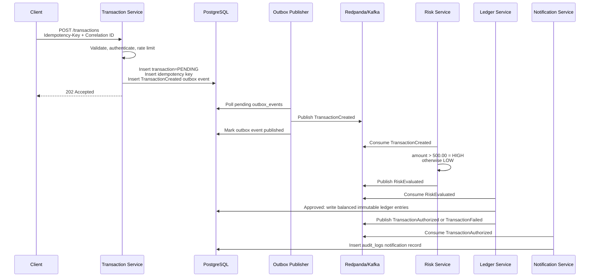

# Clearance

Clearance is a backend-heavy distributed systems MVP for payment authorization.
It takes a transaction request, persists it as `PENDING`, publishes events through
a transactional outbox, evaluates risk asynchronously, writes immutable ledger
entries for approved transactions, and simulates webhook notification delivery.

The project is intentionally small enough to run locally, but it demonstrates the
reliability patterns a payments platform would need: idempotency, durable events,
consumer retries, dead-letter handling, rate limiting, correlation IDs, structured
logs, health checks, and explicit database constraints.

## Architecture

Services:

- Transaction Service: HTTP API for `POST /transactions`.
- Outbox Publisher: drains `outbox_events` and publishes to Redpanda/Kafka.
- Risk Service: consumes `TransactionCreated` and publishes `RiskEvaluated`.
- Ledger Service: consumes `RiskEvaluated`, writes ledger entries, and publishes
  `TransactionAuthorized` or `TransactionFailed`.
- Notification Service: consumes `TransactionAuthorized` and records a simulated
  webhook notification.

Infrastructure:

- PostgreSQL for transactions, idempotency keys, outbox events, ledger entries,
  and audit logs.
- Redis for rate limiting.
- Redpanda as the Kafka-compatible broker.
- Docker Compose for local orchestration.



## Event Flow

`TransactionCreated`

- Produced by the Transaction Service through `outbox_events`.
- Contains transaction ID, account ID, merchant ID, amount, currency, status, and
  correlation ID.

`RiskEvaluated`

- Produced by the Risk Service.
- `amount_cents > 50000` is `HIGH` risk and not approved.
- All other amounts are `LOW` risk and approved.

`TransactionAuthorized`

- Produced by the Ledger Service after balanced ledger entries are inserted.

`TransactionFailed`

- Produced by the Ledger Service when risk evaluation is not approved.

## Reliability Patterns

- Idempotency: `Idempotency-Key` is required. Same key and payload returns the
  same transaction response; same key with a different payload is rejected.
- Transactional outbox: transaction creation and `TransactionCreated` outbox
  write happen in the same PostgreSQL transaction.
- Retry handling: outbox publishing and Kafka consumers retry before giving up.
- Dead-letter handling: outbox rows become `DEAD_LETTERED` after max attempts;
  failed consumer messages are written to the `dead-letter` Kafka topic.
- Correlation IDs: `X-Correlation-ID` is accepted, validated, and propagated
  through events.
- Structured logging: services use Go `slog` and avoid logging request bodies or
  bearer values.
- Health endpoints: every service exposes `/healthz`.

## Security Posture

This is an MVP, not a full fintech system, but it keeps the trust boundaries
serious:

- Transaction API requires a bearer value from `TRANSACTION_API_AUTH_VALUE`.
- Authorization headers are compared with constant-time comparison.
- Request bodies are size-limited and decoded with unknown fields rejected.
- Header values and identifiers are validated with safe-character allowlists.
- SQL uses parameterized pgx queries.
- CORS is allowlist-based through `CORS_ORIGINS`.
- Redis rate-limit keys hash client identifiers before storage.
- HTTP responses hide internal errors.
- Local Docker uses plaintext service-to-service traffic for developer
  convenience. In production, put TLS at ingress and enable TLS for Postgres,
  Redis, and Redpanda clients.
- Encryption at rest is delegated to the database/volume layer in this MVP.

## Quick Start

Create a local environment file:

```bash
cp .env.example .env
```

Set `POSTGRES_PASSWORD` and `TRANSACTION_API_AUTH_VALUE` in `.env` to local
development values.

Start the stack:

```bash
docker compose up --build
```

Health checks:

```bash
curl -i http://127.0.0.1:8080/healthz
curl -i http://127.0.0.1:8081/healthz
curl -i http://127.0.0.1:8082/healthz
curl -i http://127.0.0.1:8083/healthz
curl -i http://127.0.0.1:8084/healthz
```

Create a low-risk transaction:

```bash
curl -i -X POST http://127.0.0.1:8080/transactions \
  -H "Authorization: Bearer $TRANSACTION_API_AUTH_VALUE" \
  -H "Content-Type: application/json" \
  -H "Idempotency-Key: demo-low-001" \
  -H "X-Correlation-ID: demo-trace-001" \
  -d '{
    "account_id": "acct_123",
    "merchant_id": "merchant_123",
    "amount_cents": 12550,
    "currency": "USD"
  }'
```

Create a high-risk transaction:

```bash
curl -i -X POST http://127.0.0.1:8080/transactions \
  -H "Authorization: Bearer $TRANSACTION_API_AUTH_VALUE" \
  -H "Content-Type: application/json" \
  -H "Idempotency-Key: demo-high-001" \
  -H "X-Correlation-ID: demo-trace-002" \
  -d '{
    "account_id": "acct_123",
    "merchant_id": "merchant_999",
    "amount_cents": 90000,
    "currency": "USD"
  }'
```

Inspect data:

```bash
docker compose exec postgres psql -U clearance -d clearance \
  -c "select id, amount_cents, status, risk_level from transactions order by created_at desc limit 5;"

docker compose exec postgres psql -U clearance -d clearance \
  -c "select transaction_id, account_id, amount_cents from ledger_entries order by created_at desc limit 10;"
```

## Verification

Run tests:

```bash
go test ./...
```

Run vet:

```bash
go vet ./...
```

Validate Compose:

```bash
docker compose config
```

The current test suite covers:

- idempotency and payload-conflict behavior
- transactional outbox event creation
- outbox publish retry and dead-letter state
- risk evaluation rules
- ledger entry creation and failure behavior
- Transaction Service auth, validation, CORS, rate-limit hook, and error masking

## Project Structure

```txt
cmd/
  transaction-service/
  outbox-publisher/
  risk-service/
  ledger-service/
  notification-service/
internal/
  appenv/
  domain/
  health/
  httpapi/
  kafkabus/
  ledger/
  outbox/
  postgres/
  redislimiter/
  transaction/
migrations/
  001_init.sql
```

## Resume Value

Clearance is built to show practical backend judgment rather than a giant mock
fintech product. The interesting parts are the service boundaries, outbox
pattern, async event flow, idempotent API behavior, retry and DLQ handling,
immutable ledger writes, and security controls at the API/database boundary.
