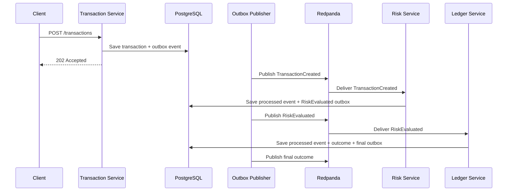

# Clearance

Clearance is a Go-based event-driven transaction authorization platform built to explore the reliability patterns that emerge once systems move beyond a single request hitting a database.

Instead of processing everything synchronously, transactions flow through an asynchronous pipeline involving transaction ingestion, risk evaluation, and ledger recording. The business logic is intentionally simple; the focus is on architecture, reliability, and failure handling.

The goal wasn’t to build a Stripe clone or a feature-heavy fintech application. The goal was to learn and demonstrate the engineering tradeoffs that appear once systems become asynchronous: idempotency, event delivery guarantees, retries, dead-letter handling, immutable writes, and failure recovery.

## Key Concepts

* Idempotency keys
* Transactional inbox/outbox pattern
* Event-driven service communication
* Retry and dead-letter handling
* Correlation IDs
* Structured logging
* Rate limiting
* Immutable ledger entries
* Explicit database constraints

## Quick Start

Create a local environment file:

```sh
cp .env.example .env
```

Set local values for:

```env
POSTGRES_PASSWORD=
TRANSACTION_API_AUTH_VALUE=
```

Start the platform:

```sh
docker compose up --build
```

Health checks:

```sh
curl -i http://127.0.0.1:8080/healthz
curl -i http://127.0.0.1:8081/healthz
curl -i http://127.0.0.1:8082/healthz
curl -i http://127.0.0.1:8083/healthz
```

Submit a transaction:

```sh
curl -i http://127.0.0.1:8080/transactions \
  -H "Authorization: Bearer $TRANSACTION_API_AUTH_VALUE" \
  -H "Content-Type: application/json" \
  -H "Idempotency-Key: idem-local-1" \
  -H "X-Correlation-ID: trace-local-1" \
  -d '{
    "account_id":"acct_123",
    "merchant_id":"merchant_123",
    "amount_cents":12550,
    "currency":"USD"
  }'
```

Optional frontend console:

```sh
cd frontend
python3 -m http.server 5173
```

Open:

```text
http://127.0.0.1:5173
```

Configure the same bearer value from `.env` and submit transactions against:

```text
http://127.0.0.1:8080
```

## What Runs

The Compose stack starts:

* `transaction-service` on `127.0.0.1:8080`
* `outbox-publisher` on `127.0.0.1:8081`
* `risk-service` on `127.0.0.1:8082`
* `ledger-service` on `127.0.0.1:8083`
* PostgreSQL
* Redis
* Redpanda

The only business-facing endpoint is:

```http
POST /transactions
```

Requests require:

```http
Authorization: Bearer <TRANSACTION_API_AUTH_VALUE>
Idempotency-Key: <unique-key>
```

Optional:

```http
X-Correlation-ID: <trace-id>
```

Accepted requests return:

```http
202 Accepted
```

with a transaction in a `PENDING` state. Risk evaluation and ledger writes happen asynchronously through Redpanda.

## Architecture

The system is split into several focused services, each responsible for a single stage of the transaction lifecycle.

### Transaction Service

Accepts transaction requests, validates input, enforces idempotency, and persists transactions as `PENDING`.

Instead of publishing directly to Kafka, it writes a `TransactionCreated` event to an outbox table within the same database transaction. This avoids the classic “database write succeeded but event publish failed” problem.

### Outbox Publisher

Continuously polls pending outbox events using `FOR UPDATE SKIP LOCKED`, publishes them to Redpanda, and updates their state.

Failed outbox publishes are retried before the PostgreSQL row is marked
`DEAD_LETTERED`. That terminal database state is separate from the Kafka
dead-letter topic used by consumers.

### Risk Service

Consumes `TransactionCreated` events and evaluates risk asynchronously.

Current rules are intentionally simple:

* Amounts over `$500.00` are considered high risk
* Everything else is approved

The risk decision and consumed event ID are stored atomically with a
`RiskEvaluated` outbox event. The purpose is to demonstrate service boundaries
and event flow rather than risk modeling.

### Ledger Service

Consumes risk decisions and records the outcome in an immutable ledger.

Approved transactions are authorized only when the account has enough available
ledger balance. Successful authorizations generate balanced ledger entries and a
`TransactionAuthorized` outbox event in the same database transaction.

Rejected or unfunded transactions atomically produce a `TransactionFailed`
outbox event with their final database state.

### Event Flow



## Persistence And Messaging

PostgreSQL stores:

* Transactions
* Idempotency keys
* Processed Kafka event IDs and payload hashes
* Outbox events
* Ledger entries

Redis provides fixed-window rate limiting.

Redpanda serves as the Kafka-compatible event broker connecting services.

One of the core design decisions is the transactional inbox/outbox pattern.

Transaction creation, request idempotency storage, and event creation all occur
within a single database transaction. Risk handling atomically stores its input
event ID with the risk outbox event. Ledger handling atomically stores its input
event ID, final transaction state, ledger entries, and final outbox event. Events
are published only after they have been durably recorded.

## Reliability Patterns

### Idempotency

Every transaction requires an `Idempotency-Key`.

Submitting the same request multiple times returns the same transaction.

Reusing an idempotency key with a different payload is rejected.

### Transactional Outbox

Every stage that changes PostgreSQL and produces a normal business event writes
that event atomically to the shared outbox.

If the database transaction succeeds, its successor event exists and can be
published later. Kafka publication is at-least-once, so an event can still be
published more than once if publication succeeds but marking the outbox row as
published fails.

### Consumer Idempotency And Ordering

Kafka message keys contain the account ID so events for one account are routed
consistently within each topic. A separate stable `event_id` header identifies
the durable outbox event.

Risk and ledger consumers store the event ID and a payload hash in the same
PostgreSQL transaction as their database effects and successor outbox event.
Replaying the same event ID and bytes is a successful no-op. Reusing an event ID
with different bytes is rejected and follows the normal retry/DLQ path.

This provides effectively-once database side effects for replay of the same
event ID. It does not provide Kafka exactly-once semantics, global ordering
across topics, or duplicate-free delivery.

### Retries And Dead-Letter Handling

Publishers and consumers automatically retry transient failures.

Outbox rows that exceed retry limits are marked `DEAD_LETTERED` in PostgreSQL.
Consumed Kafka messages that exhaust handler retries are published to the Kafka
dead-letter topic before their source offset is committed. Neither path promises
exactly-once dead-letter delivery.

### Correlation IDs

`X-Correlation-ID` values are propagated through every event.

This makes it possible to trace a request across multiple services.

### Structured Logging

All services use structured logging and avoid leaking request bodies, secrets, or bearer values.

### Health Checks

Every service exposes:

```http
GET /healthz
```

for monitoring and orchestration.

### Metrics

Set `METRICS_ENABLED=true` to expose basic Prometheus counters on `/metrics`.

## Security Considerations

This is an MVP, not a production fintech platform, but trust boundaries are treated seriously.

Current controls include:

* Bearer token authentication
* Constant-time auth comparison
* Request size limits
* Strict request validation
* Parameterized SQL queries
* CORS allowlists
* Redis-backed rate limiting
* Error masking
* Header validation

For local development, service-to-service traffic is unencrypted.

In production, TLS should be enabled at ingress and for PostgreSQL, Redis, and Redpanda connections.

## Verification

Run tests:

```sh
go test ./...
```

Run vet:

```sh
go vet ./...
```

Validate Compose:

```sh
docker compose config
```

The test suite covers:

* Idempotency behavior
* Payload conflict detection
* Transactional outbox creation
* Outbox retry logic
* Dead-letter handling
* Risk evaluation rules
* Ledger entry creation
* Authentication and validation paths
* Rate limiting and error handling

GitHub Actions runs:

```sh
go test ./...
go test -tags=integration ./internal/postgres
go vet ./...
go build ./cmd/...
cd frontend && npm ci && npm test && npm run build
docker compose config
```

## Project Structure

```text
cmd/
  transaction-service/
  outbox-publisher/
  risk-service/
  ledger-service/
internal/
  appenv/
  domain/
  health/
  httpapi/
  kafkabus/
  ledger/
  outbox/
  postgres/
  redislimiter/
  risk/
  transaction/
migrations/
  001_init.sql
  002_consumer_reliability.sql
```

## Known Limits

This project intentionally prioritizes architecture over business complexity.

Current limitations:

* Risk evaluation uses simple threshold rules
* Frontend is a lightweight demo console
* No funding/deposit API yet; successful authorization requires existing ledger balance
* No transaction query APIs yet
* No DLQ inspection tooling
* Metrics are basic Prometheus counters and are disabled by default
* No Grafana dashboards
* No distributed tracing UI yet
* No Kubernetes deployment
* Kafka and DLQ delivery are at-least-once; duplicate broker messages remain possible
* Processed-event records currently have no retention or replay-management tooling
* PostgreSQL transaction guarantees have integration coverage, but there is no automated real-broker failure suite yet

## Why I Built It

Most side projects stop at:

```text
Request -> Application -> Database
```

Clearance started there too.

The purpose of this version was to push beyond CRUD and explore the reliability challenges that appear once work becomes asynchronous.

The most interesting part of the project isn’t authorizing a payment. It’s making sure the system behaves predictably when things go wrong.

By introducing service boundaries, event-driven workflows, idempotency, retries, dead-letter handling, and immutable ledger writes, the project became less about payment processing and more about learning how distributed systems maintain consistency and reliability under failure.
