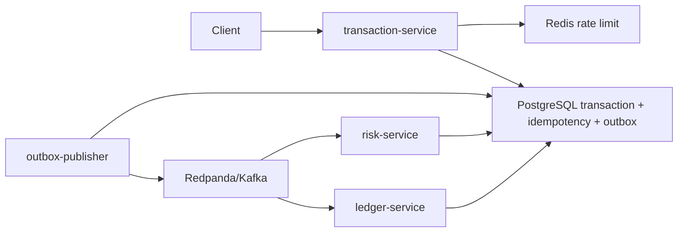

# Architecture

Clearance v2 is a Go event-driven payments authorization MVP. It keeps the
domain intentionally small, but the backend shape mirrors production payment
systems: durable writes first, asynchronous event processing second, and
observable service boundaries throughout.

## Current State

Services:

- `transaction-service`: authenticated HTTP APIs for payment creation,
  transaction reads, operator listing, and demo/operator deposits.
- `outbox-publisher`: drains PostgreSQL `outbox_events` into Redpanda/Kafka.
- `risk-service`: consumes `transactions.created` and atomically records each
  input event with a `RiskEvaluated` outbox row.
- `ledger-service`: consumes risk decisions, writes immutable ledger entries,
  and atomically records final transaction outcomes in the outbox.

Infrastructure:

- PostgreSQL stores transactions, request and deposit idempotency records,
  processed-event records, durable DLQ records, operator actions, outbox rows,
  and ledger entries.
- Redis backs fixed-window API rate limiting.
- Redpanda provides Kafka-compatible topics.
- Every Go service exposes `/healthz`; typed Prometheus `/metrics` is available
  when `METRICS_ENABLED=true`. A local Prometheus/Grafana profile is provisioned.

## Reliability Patterns

- Idempotency keys protect client retries.
- Every database-producing stage records its successor event in the same
  PostgreSQL transaction as its state changes.
- Kafka messages carry a stable `event_id` header and are partitioned by account
  ID within each topic.
- Consumers record `(consumer_name, event_id, payload_hash)` before committing
  Kafka offsets. Replaying the same event ID is a successful no-op; reusing it
  with different bytes is rejected.
- Kafka producers require all acknowledgements.
- Consumers retry with backoff before dead-lettering failed messages.
- Ledger authorization checks available account balance before writing immutable,
  balanced entries.
- Correlation IDs flow through HTTP responses and Kafka message headers.
- Structured logs avoid request bodies and bearer values.
- Optional metrics expose HTTP status counts, Kafka publish results, and outbox
  outcomes, latency histograms, consumer retries/commit failures, runtime
  metrics, operational backlog, DLQ, retention, and database-pool gauges.
- Consumer failures persist the exact source bytes and coordinates before Kafka
  DLQ publication. A trusted CLI provides guarded exact replay and audited
  outbox recovery.
- Processed-event retention is bounded, previewable, serialized with an
  advisory lock, and constrained to exceed the replay window.

Kafka delivery remains at-least-once. The outbox publisher can publish the same
event again if Kafka accepts it but the database status update fails. Stable
event IDs plus same-transaction processed-event records make database side
effects effectively once for replay of the same event ID; they do not provide
Kafka exactly-once semantics or duplicate-free topics.

## Active Scope

- Active backend code is Go under `cmd/` and `internal/`.
- Active database setup is numbered SQL under `migrations/`.
- The active HTTP APIs are `POST /transactions`, `GET /transactions/{id}`,
  operator-only `GET /transactions`, and `POST /accounts/{id}/deposits`, plus
  health and optional metrics.
- The optional frontend console submits transactions and polls the durable
  transaction status endpoint until a final state is visible.
- Destructive recovery remains outside HTTP in the `clearance-admin` trusted
  operations CLI.

## Operational Boundaries

- Deposits are a trusted operator/demo funding rail, not proof of external
  settlement.
- Authentication is separated by transaction, funding, and operator bearer
  values, but remains static-token authentication rather than an identity and
  role system.
- The local Redpanda topology is a single broker. The isolated failure suite
  proves application behavior during outage/recovery, not broker high
  availability.
- Kafka delivery remains at-least-once. Database side effects are effectively
  once only for the same stable event ID and identical bytes.
- Retention tooling is manual and requires an external scheduler.
- OpenTelemetry tracing, a tracing UI, Kubernetes, and customer-scoped query
  authorization remain outside the current implementation.
