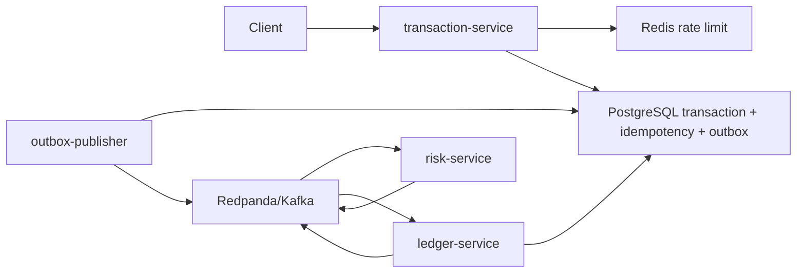

# Architecture

Clearance v2 is a Go event-driven payments authorization MVP. It keeps the
domain intentionally small, but the backend shape mirrors production payment
systems: durable writes first, asynchronous event processing second, and
observable service boundaries throughout.

## Current State

Services:

- `transaction-service`: authenticated HTTP API for `POST /transactions`.
- `outbox-publisher`: drains PostgreSQL `outbox_events` into Redpanda/Kafka.
- `risk-service`: consumes `transactions.created` and publishes risk decisions.
- `ledger-service`: consumes risk decisions, writes immutable ledger entries,
  and publishes final transaction outcomes.

Infrastructure:

- PostgreSQL stores transactions, idempotency records, outbox rows, ledger
  entries.
- Redis backs fixed-window API rate limiting.
- Redpanda provides Kafka-compatible topics.
- Every Go service exposes `/healthz`; `/metrics` is available when
  `METRICS_ENABLED=true`.

## Reliability Patterns

- Idempotency keys protect client retries.
- Transactional outbox prevents losing `TransactionCreated` after a database
  commit.
- Kafka producers require all acknowledgements.
- Consumers retry with backoff before dead-lettering failed messages.
- Ledger authorization checks available account balance before writing immutable,
  balanced entries.
- Correlation IDs flow through HTTP responses and Kafka message headers.
- Structured logs avoid request bodies and bearer values.
- Optional metrics expose HTTP status counts, Kafka publish results, and outbox
  outcomes.

## Active Scope

- Active backend code is Go under `cmd/` and `internal/`.
- Active database setup is SQL under `migrations/001_init.sql`.
- The active HTTP API is only `POST /transactions`, plus health and optional
  metrics.
- The optional frontend console talks to `POST /transactions` on the Go
  transaction service.

## Feature Ranking

1. Observability MVP: opt-in Prometheus-compatible `/metrics` on every Go service.
   Highest ROI because the architecture already has events, Redis, Kafka, and
   reliability patterns, but needed a visible operations surface.
2. Failure-mode demo script: proves outbox retry, DLQ, and recovery under broker
   outage.
3. Transaction status read API: makes eventual consistency easy to inspect from
   a client.
4. Consumer lag/DLQ dashboard: strong SRE signal once metrics have enough data.
5. OpenTelemetry traces: valuable after metrics exist, but higher setup cost.

## Built MVP

The first MVP is the observability layer:

- opt-in `GET /metrics` on `transaction-service`.
- opt-in `GET /metrics` on worker health servers.
- `clearance_http_requests_total{method,path,status}`.
- `clearance_kafka_messages_published_total{topic,result}`.
- `clearance_outbox_events_total{result}`.
