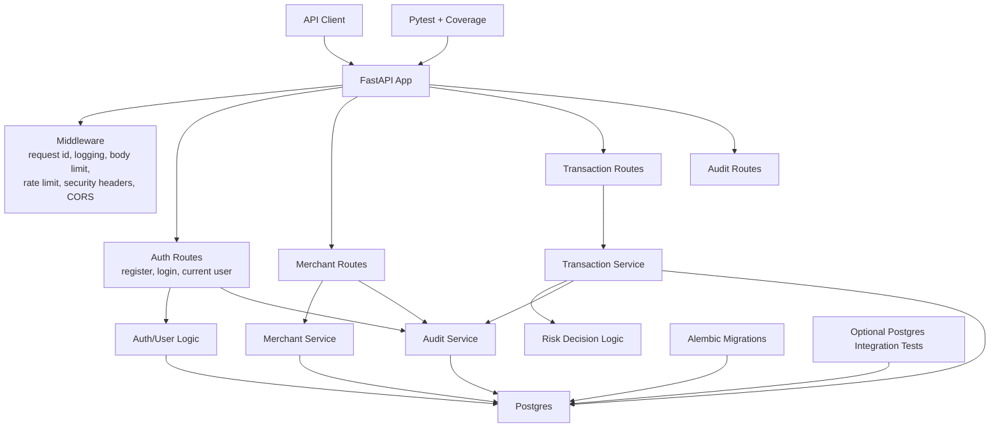
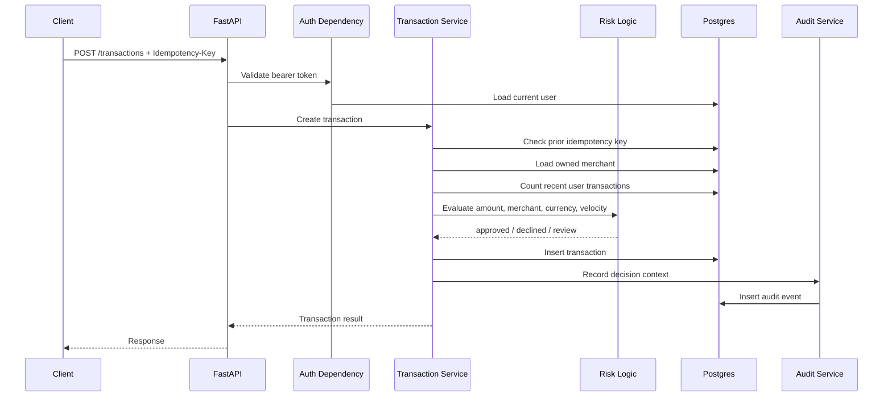

# Architecture

Clearance is currently a modular monolith. The code is split by responsibility inside one deployable FastAPI service instead of being split into services before the domain needs that complexity.

## System Diagram

## Request Flow

Most protected requests follow the same path:

1. Middleware assigns or validates a request ID and applies cross-cutting safety checks.
2. FastAPI routes parse the HTTP request.
3. Pydantic validates request shape and rejects unknown fields.
4. The auth dependency verifies the JWT and loads the current user.
5. Route handlers call service functions for domain behavior.
6. SQLAlchemy reads/writes durable state in Postgres.
7. Audit events are recorded for important actions.
8. Response models shape what the client receives.

## Transaction Decision Flow

## Main Guarantees

- A user can only access resources scoped to their own user id.
- Duplicate transaction retries with the same idempotency key and same payload return the original transaction.
- Reusing an idempotency key with a different payload returns `409 Conflict`.
- Risk decisions are persisted with a score and reason.
- Important actions are recorded in audit events.
- Runtime configuration fails fast when required secrets or invalid security values are missing.
